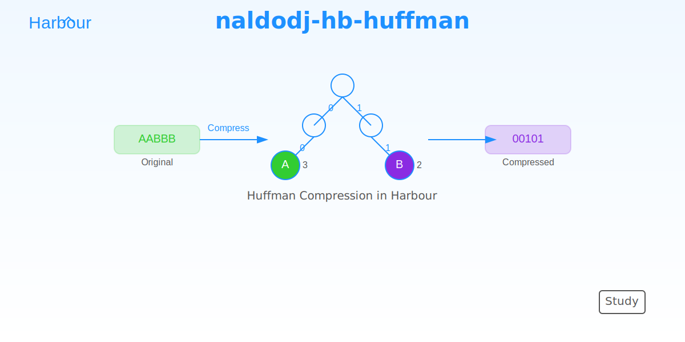

# naldodj-hb-huffman



Bem-vindo ao `naldodj-hb-huffman`, uma implementação do algoritmo de Huffman em Harbour, projetada para fins de estudo e aprendizado. Este projeto oferece uma abordagem prática para explorar os conceitos de compressão e descompressão de dados sem perdas, utilizando uma linguagem moderna como Harbour combinada com otimizações em C.

## Sobre o Projeto

O `naldodj-hb-huffman` é um projeto educacional que implementa o algoritmo de Huffman, uma técnica amplamente utilizada para compressão de dados baseada na frequência de ocorrência de símbolos (neste caso, caracteres). Ele foi desenvolvido para servir como uma ferramenta de estudo, permitindo que desenvolvedores e entusiastas compreendam os detalhes do algoritmo enquanto experimentam com uma implementação funcional e otimizada.

### O Algoritmo de Huffman

O algoritmo de Huffman, criado por David A. Huffman em 1952, é um método de compressão sem perdas que atribui códigos binários de comprimento variável a símbolos com base em sua frequência no texto. Caracteres mais frequentes recebem códigos mais curtos, enquanto os menos frequentes recebem códigos mais longos, resultando em uma representação compacta dos dados. A construção de uma árvore binária (árvore de Huffman) é o coração do processo, onde:

1. **Contagem de Frequências**: Cada caractere do texto é analisado para determinar sua frequência.
2. **Construção da Árvore**: Os caracteres são organizados em uma estrutura de árvore, combinando os menos frequentes iterativamente até formar uma única raiz.
3. **Geração de Códigos**: A árvore é percorrida para atribuir códigos binários (0 para esquerda, 1 para direita) a cada caractere.
4. **Compressão e Descompressão**: O texto é codificado com os códigos gerados, e a descompressão recria o texto original usando a mesma árvore ou informações equivalentes.

Esta implementação destaca-se por sua abordagem prática, com otimizações que tornam o aprendizado mais tangível, como o uso de uma função em C para contar e remover caracteres dinamicamente e a reconstrução eficiente da árvore na descompressão.

### Características Principais
- **Foco Educacional**: Ideal para estudar os fundamentos da compressão de dados.
- **Desempenho Otimizado**: Inclui melhorias como manipulação de bits em C e reconstrução dinâmica da árvore.
- **Flexibilidade**: Funciona com textos pequenos ou grandes, servindo como base para experimentação.
- **Domínio Público**: Livre para estudo, modificação e uso em projetos pessoais ou acadêmicos.

## Estrutura do Repositório

O projeto é composto por dois arquivos principais:

- **[huffmannode.prg](https://github.com/naldodj/naldodj-hb-huffman/blob/main/src/core/huffmannode.prg)**  
  O núcleo do algoritmo, contendo a classe `HuffmanNode` com métodos para construir a árvore, comprimir e descomprimir dados. Veja o código-fonte completo [aqui](https://raw.githubusercontent.com/naldodj/naldodj-hb-huffman/refs/heads/main/src/core/huffmannode.prg).

- **[huffmannode_tst.prg](https://github.com/naldodj/naldodj-hb-huffman/blob/main/src/tst/huffmannode_tst.prg)**  
  Um programa de teste que ilustra o uso do algoritmo com exemplos práticos, incluindo textos curtos e a leitura de arquivos como `loremipsum.txt`. Confira os testes [aqui](https://raw.githubusercontent.com/naldodj/naldodj-hb-huffman/refs/heads/main/src/tst/huffmannode_tst.prg).

## Como Usar

1. **Requisitos**:
   - Harbour 3.x instalado.
   - Suporte a `HB_CODEPAGE_UTF8EX` para manipulação de texto UTF-8.

2. **Exemplo Básico**:
   ```harbour
   #include "huffmannode.prg"

   procedure Main()
      local oHuffman := HuffmanNode():New()
      local cTexto := "Hello, Huffman!"
      local hCompressed, cDecompressed

      hCompressed := oHuffman:HuffmanCompress(cTexto)
      cDecompressed := oHuffman:HuffmanDecompress(hCompressed)

      ? "Original:", cTexto
      ? "Compressed:", hb_JSONEncode(hCompressed)
      ? "Decompressed:", cDecompressed
      return
   ```

3. **Testes**:
   Execute o arquivo `huffmannode_tst.prg` para explorar exemplos de compressão e descompressão, incluindo um teste com o arquivo `loremipsum.txt` (se disponível em `./data/`).

## Instalação

Clone o repositório e compile os arquivos com o Harbour:

```bash
git clone https://github.com/naldodj/naldodj-hb-huffman.git
cd naldodj-hb-huffman
hbmk2 src/tst/huffmannode_tst.prg -o huffman_test
```

## Contribuições

Este é um projeto de estudo, e contribuições são bem-vindas! Sinta-se à vontade para abrir issues com perguntas, sugestões ou melhorias, ou enviar pull requests com ajustes. Explore, aprenda e adapte o código como desejar.

## Licença

O projeto está em **Domínio Público**, conforme indicado no cabeçalho dos arquivos. Use-o livremente para fins educacionais, pessoais ou experimentais.

## Créditos

Desenvolvido por [NaldoDJ](https://github.com/naldodj), com otimizações e ideias inspiradas em discussões técnicas e na comunidade Harbour.

---
